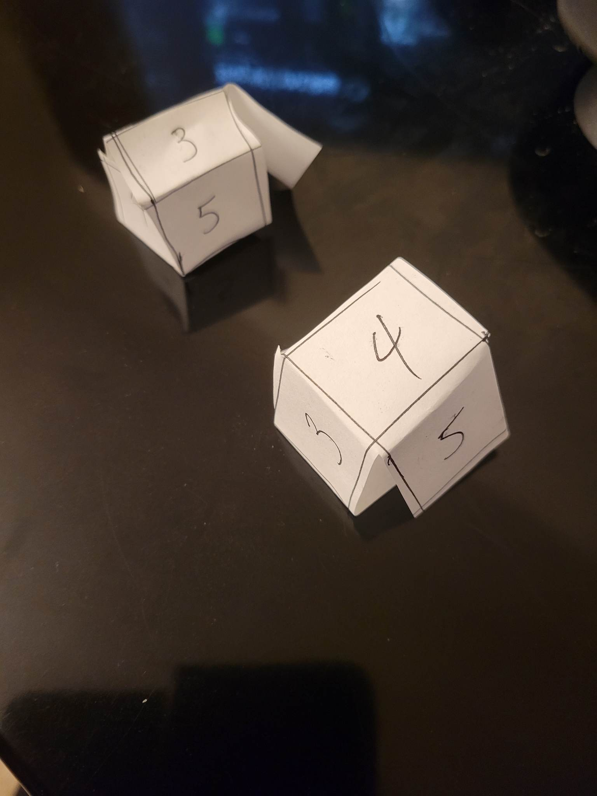

# Advent of Code 2022

Answers written in Rust. Usually answers are what comes
to mind first. If it doesn't work, then something else is tried.
All solutions are best-effort-with-reasonable-attempts.

## short summaries (some spoilers)
day 01 - find largest sum; find sum of 3 largest sums

day 02 - some mod math for rock paper scissors as ints; some more mod math for rock paper scissors but whether we lose, draw, or win.

day 03 - Checking set intersections of half strings; then checking set intersections of 3 strings

day 04 - Checking int range containment; then checking int range overlap

day 05 - Rebuild board, then move via pop and push one at a time in order; move slices around (Simulation)

day 06 - Find end index of first 4 distinct; Find end index of first 14 distinct. Just used a sliding window.

day 07 - Regrets with Rust. The hard part for me was figuring out how to reconstruct directory information from strings initially without references to each other. This meant that we couldn't build the map as we were reading the data due to Rust's ideas of ownership and whatnot. I ended up doing this in two passes, once to collect directory content information and the second to actually create the directory structure and populate it so that it can be traversed. The question itself wasn't even that bad, it was just checking numbers against some other numbers.

day 08 - Rows and Cols got mixed up, but otherwise this was fine. Basically keeping track of things in a grid. 1.) was seeing if we can see the edge in any direction from each position. 2.) was rolling up to the current height in each direction and seeing how many things there are that we can see in our sightline.

day 09 - Following a moving point, basically just checked diffs and clamped; extend it and iterate over changes.

day 10 - Really weird instructions, doing math on some instruction cycles then checking if the current position is close enough to the register value.

day 11 - Simulating monkeys passing things around based on some mult/add ops and mod testing; the second part needed to do some modular arithmetic.

day 12 - started using backtracking, then dp to try to get the cost to get to the goal from any path, but I realized that I was doing a DFS rather than a BFS and didn't actually save the shortest path to a single place due to the order in which things are evaluated, then realized that I could just use a BFS.

day 13 - Nested arrays and comparing nested arrays.

day 14 - Simulation. One grain/one blocked wall piece at a time vs. actually writing out a map/setting for the problem; then the same, but with a floor.

day 15 - Working with ranges and collapsing ranges, then iterating over things, kind of brute-forced for part 2. Looked up some ideas off reddit after finishing and came across one that could try to find diagonals with one-pixel gaps between the diamonds, then we can technically use the intersections of all the diagonals to narrow down the location. Combinatorially this sounds not terrible because the number of diagonals of width 1 are likely very small. This means at least an n^2 comparison between rhombuses to get the length of comparisons and where they possibly exist, which is limited by size/length.

day 16 - This was painful. I started doing BFS with state (only paying attention to distances to the next valve) and that worked well enough. I also did a shortcut where instead of keeping track of the rate, I just kept track of the contribution of opening each valve when I open it. This meant we didn't need to keep track of the rate. Then for the second part, I tried modeling this as two agents and this worked, but the solution took too long to run, it felt like waiting for the heat-death of the universe. I then ended up rewriting it with some hints from reddit to just consider the paths as disjoint sets and trying to maximize the pressure released with disjoint sets. This meant that we just had to brute-force all valve-paths that can be explored in 26 minutes. Then afterwards, we know that there are duplicate paths, so we can sort the traveled paths and find the most pressure released for each path. After that, we can check combinations of the paths (making sure there's no intersection/overlap) and the sum of the best non-overlapping pressures should give us the most pressure we can achieve with two agents.

day 17 - This wasn't as bad, but there were a lot of small mistakes. The first one was like a tetris simulation. The second one was like trying to detect patterns and cycles in the encoding. I ended up doing a 25-length window to check for patterns with Floyd's cycle-detection algorithm. I had a really troubling off-by-one error due to including the start of the cycle in the solution rather than starting one before it so I could include the first cycle as part of the answer. This also led to another bug with the cycle height contribution being off by one (since I took the diffs starting from the beginning of the cycle rather than one before). (This isn't an issue with the actual input because the diff at the beginning was actually 0 with one step previous.)

day 18 - This wasn't too bad. I ended up just modeling each block and checking adjacent blocks(/spaces for pt. 2). Basically I just did an exhaustive adjacent space search to find the contained spaces. If we reached beyond a boundary, then we know that the existing blocks are not containing and that "steam" can reach the hole. We use a set of Blocks to not repeat work/overcount. I had a small typo where I returned None for the seen set when I should've returned 0 for it already being counted. This is an issue when we check back against ourselves in the current space-check, since it would return None as in that it reached a boundary rather than 0 for something that we already checked.

day 19 - DFS without path tracking. Had a working BFS search, but then that took too long, so switched to DFS with several heuristics/shortcuts to prune states. Like we don't explore one minute at a time, but on worker changes. We also prune things that are impossible to beat what we've seen so far (regardless of resource constraints). We also skip the worker when we have more resources than we can use in a turn.

day 20 - Basically just circular array math. I got stuck on the fact that there could be duplicates in the input, so I ended up spending way too much time questioning whether my circular array math was correct vs. time inspecting the input :facepalm: Other than that, this was pretty straight-forward. The first soln was shuffling/mixing once and then the second time was just doing it 10 times.

day 21 - Not too bad, basically creating a DAG, then evaluating the DAG. The second part was just evaluating the DAG but keeping a branch unevaluated. Then working backwards to evaluate the unevaluated branch using reverse ops.

day 22 - This one was an interesting problem, part 1 was just constructing a map that we could wrap around the edges of and part 2 was a little gnarly in that we construct a map that was essentially a cube. Part 2 was interesting in that we had the normal idea of what a map is, but now we have to figure out how to construct a cube when we just know the adjacent cube surfaces. I first split up the cube surfaces to get the main regions of interest. I determined the unknown adjacent cube surfaces iteratively. This means that on each step, we tried to learn what the neighboring unknown cube edges by looking at the ones that we do know, e.g. if we don't know what's above us, we can check the left face and up or the right face and up to determine what the up face should be. This should eventually spread knowledge of all adjacent cube faces to every cube face after several rounds, allowing us to learn the relative cube surfaces. The hard part was keeping track of the right orientation when we moved from face to face, especially since surfaces get rotated as we fold the cube up. We repeat this until we no longer have any unknown adjacent cube surfaces. (We initially kept up, right, down, and left the same as the original orientation to make things easier. This meant we only actually had to solve for map edges, but any overwriting of any edges on a cube surface should still be correct.) It was a challenge keeping track of the right/relative orientations and I ended up using visual aids to help with this and to validate that this would produce the right directions for each adjacent cube face. I also added direction information in my movement instructions, allowing me to rotate properly to different orientations when moving across edges of the cube. After we find this out, it was mostly straightforward to stitch the edges together. We did this by iterating through the edges in a clockwise manner, so whenever we stitched two edges together, we just had to reverse the list we're interested in stitching an edge with. After that, we just had to walk the map and keep track of the new directions.

day 23 - Not too bad for a simulation question, worst part was reading the instructions properly. I ended up getting bugs because I processed things in the wrong order or didn't read the instructions closely enough (i.e. the order of direction evaluation changing after each round rather than each time it's selected). Besides that, the question was pretty straightforward.

day 24 - Not too bad, basically just a search problem in a specific setting. For the environment, I tracked the walls and positions and which positions are occupied by blizzards at each step. We only simulated the environment once per step, so we didn't need to do the same evaluation multiple times. Then I pretty much just stepped through the environment to figure out what valid positions I could be in (stay, left, up, right, or down). I started with a BFS because I thought that it would be short enough to get the optimal path, but the states exploded too much to get the result in time for the actual input. Then I switched to a priority queue implementation with the priority for evaluation being a heuristic that was the time passed so far + distance to the goal. This meant that we evaluated results closer to the goal. Then we sped this up by skipping time passed + distance greater than the best solution we've found. We also trimmed this further by keeping track of what we've seen so that we could skip those and not redundantly search state.

day 25 - Basically balanced base 5, so each digit representation ranges from like [-2, 2]. Balanced base 5 to decimal was easy enough since we can just do like 5^place to get the decimal value for each location. The harder part was decimal to balanced base 5, but I realized that I could just find the largest number in balanced base 5 that could hold the value we're looking for and start from there. Then I realized that the ranges we're interested in are like 5^place / 2, since each number should have a single representation. This meant that as long as the target number was within the range, then we know that this range was correct and we can lock in the character/number thing for that digit and we continue looking for the next digit by consecutively minimizing these rarnges until we found the right representation for the target value.
